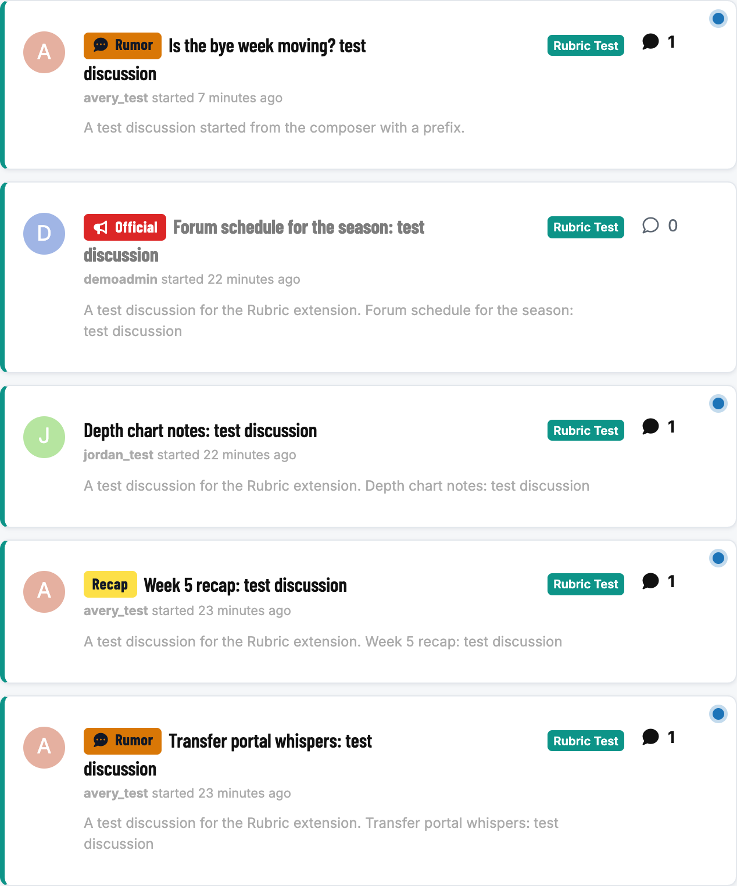
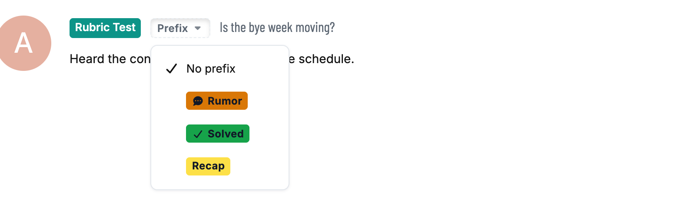
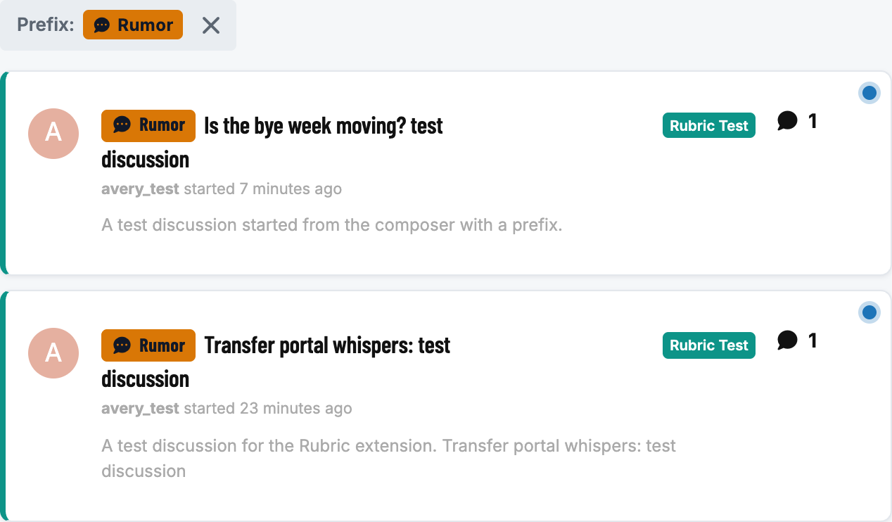
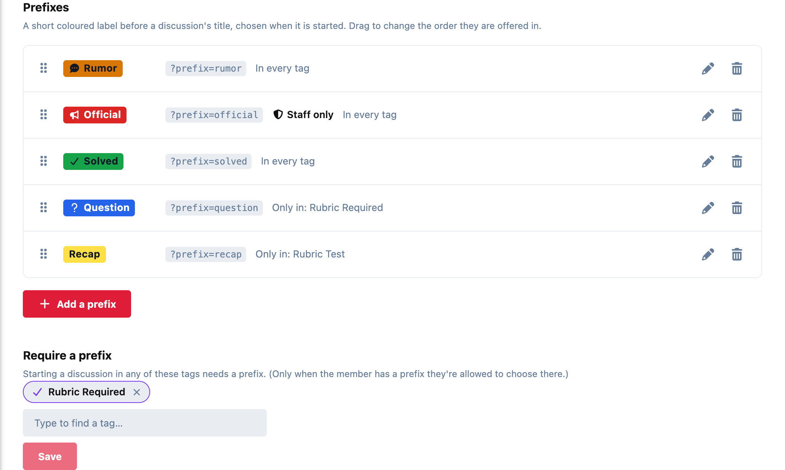
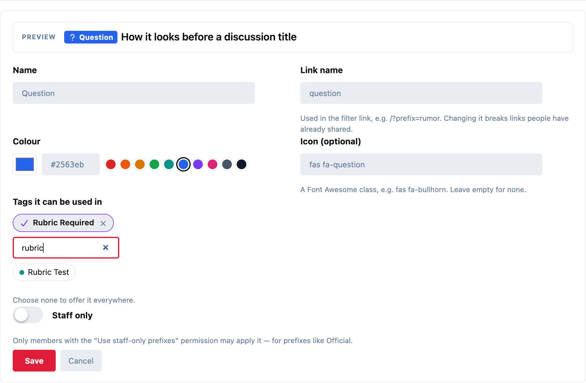

# Rubric

Thread prefixes for Flarum 2: a short coloured label before a discussion's title, the way traditional forums have always had them. **Rumor**, **Official**, **Solved**, **Question** — chosen when the discussion is started, and separate from tags.



## Choosing one

The composer gets a prefix picker beside the tag selector. It only offers the prefixes that fit the tags you've chosen and that you're allowed to use.



Anyone who can rename a discussion can change its prefix later, from **Change prefix** in the discussion's controls. The label shows on the discussion page too:


## Filtering

Click a label to see every discussion with that prefix. The link is shareable (`/?prefix=rumor`, or `/t/some-tag?prefix=rumor` inside a tag), and the filter shows as a chip you can clear:



The search box understands it as well: `prefix:rumor`. For the API, it's `filter[prefix]=rumor` on `/api/discussions` (several at once: `rumor,official`; exclude with `filter[-prefix]`).

## Settings

Admin → Rubric:



Each prefix has:

- **Name** and **colour.** The text on the label turns dark or light to suit the colour, so any colour stays readable.
- **Icon** (optional), any Font Awesome class.
- **Tags it can be used in.** None chosen means everywhere.
- **Staff only.** For prefixes like Official: only members with the **Use staff-only prefixes** permission (under Moderate in Permissions; moderators by default) can apply it.

Drag the handles to change the order they're offered in. A live preview shows the label as you edit:



**Require a prefix** lists the tags where a new discussion must have one. It only applies when the member has at least one prefix they're allowed to choose there, so a tag whose only prefix is staff-only never locks members out.

## Good to know

- **Checked on the server.** The prefix has to exist, fit the discussion's tags, and be one the member may use; a staff-only prefix from anyone else is refused, and so is a missing prefix in a tag that requires one.
- **No extra requests.** The prefix list is small and arrives with the forum's own data, so labels in a long list cost nothing.
- **Deleting a prefix** leaves its discussions as they were, just without the label.
- **Fits your theme.** It uses the theme's own colours for everything but the label itself, so it works with the default theme, Bespoke and dark mode.

## Installation

```bash
composer require ernestdefoe/rubric
php flarum migrate
php flarum cache:clear
```

Then enable **Rubric** in the admin panel.

## Updating

```bash
composer update ernestdefoe/rubric
php flarum migrate
php flarum cache:clear
```

## Licence

MIT.
